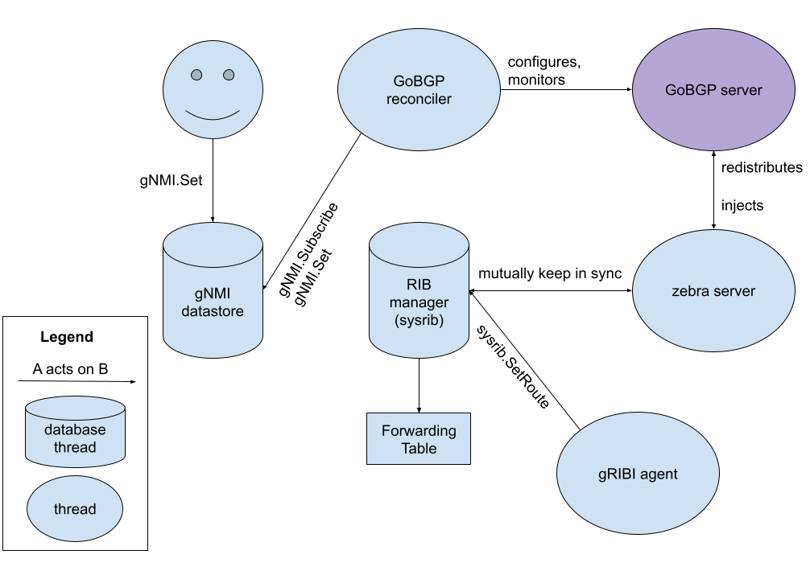

<!-- markdownlint-disable MD007 MD030 -->

# Lemming and GoBGP



## Integration of GoBGP into Lemming

Lemming’s support for OpenConfig BGP features relies on the open source
[GoBGP](https://github.com/osrg/gobgp/) project. This choice was made to make
use of an existing production-ready BGP agent written in Go, as well as to take
advantage of its
[OpenConfig-derived configuration](https://github.com/osrg/gobgp/blob/master/docs/sources/policy.md)
to minimize glue code. To understand how lemming integrates GoBGP to enable this
support, it is helpful to break down system requirements into several focused
mechanisms and properties, which together provides lemming with the above BGP
support:

1.  Translating from OpenConfig path-value pairs to GoBGP configuration (**GoBGP
    reconciler**).
2.  Support for declarative configuration (**GoBGP reconciler**).
3.  Support for route redistribution from RIB manager to BGP agent (**zebra
    server**).
4.  Support for route injection from BGP agent to RIB manager (**zebra
    server**).

In addition to feature support, the lemming project supports lightweight ways of
validating BGP features. This includes testing using lemming images within a KNE
cluster, as well as a lighter-weight local testing where multiple lemmings are
instantiated as separate threads within a single test process.

The following sections will explain the relevant lemming system components that
enables the above system requirements as well as the testing environment.

## Explanation of System Components

### GoBGP server

The GoBGP server lemming’s BGP speaker. The GoBGP reconciler starts the GoBGP
server as a separate set of threads (goroutines) alongside other threads within
lemming. This enables regular TCP connections to be established with other BGP
speakers. Its implementation and documentation resides in
<https://github.com/osrg/gobgp>. Notably, it uses OpenConfig-derived
configuration that can be easily mapped from the latest OpenConfig models, and
supports declarative configuration semantics upon configuration updates.

### GoBGP Reconciler

A running lemming process is organized as a set of threads communicating
information with each other via a gNMI-based central database (gNMI datastore).
This datastore also exposes a gNMI interface to the user, who is able to update
the datastore with the desired OpenConfig configuration. Threads that subscribe
to the gNMI datastore and “reconcile” the system state into the user-desired
configuration are named “reconcilers”. Therefore, the GoBGP reconciler is
responsible providing OpenConfig BGP features to lemming.

The reconciler achieves this by translating OpenConfig configuration to the
semantically-equivalent GoBGP configuration, and then configuring the GoBGP
server. The configuration is done in a full config replace manner to achieve
declarative semantics. Its other primary responsibility is to monitor the GoBGP
server and update BGP applied state in the gNMI datastore, for example BGP RIB
state.

### RIB Manager (sysrib) and Zebra Server

The RIB manager (named the `sysrib` package) manages all routes by all routing
protocols supported in lemming and carries out recursive resolution. In the
context of BGP, it is also responsible for redistributing routes to GoBGP as
well as receiving BGP routes for resolution in the RIB.

In order to achieve RIB integration with GoBGP, lemming takes advantage of the
fact that it natively supports
[Zebra API integration](https://github.com/osrg/gobgp/blob/master/docs/sources/zebra.md)
as a Zebra API client. On startup, lemming is initialized with a simple Zebra
server that syncs route updates between the RIB manager and the GoBGP server. In
particular, whenever a new resolved route appears in the RIB manager, it is sent
to the Zebra server that then redistributes it to GoBGP; in the other direction,
whenever GoBGP receives a route in its local RIB, the route gets injected into
the Zebra server, which is then received by the RIB manager, making it available
for route resolution.

## Life of a BGP Route High-level Walkthrough

1.  Upon lemming’s initialization with necessary BGP parameters (AS path and
    RouterID), the **GoBGP reconciler** starts the **GoBGP server**, which
    registers itself as a client to the **Zebra server**.
2.  Upon receiving configuration for BGP peer, the **GoBGP reconciler**
    configures the peer in the **GoBGP server**, which starts its internal BGP
    state machine to look for the peer. See
    [GoBGP: Life of a BGP UPDATE message](life_of_a_bgp_update_message.md) for
    some rough notes on how BGP update messages propagate through GoBGP itself.
3.  When a BGP route is received, the **GoBGP server** internally applies
    configured policies against the route, which may or may not be propagated to
    the local RIB, as well as other peers via the `ADJ_OUT` RIBs.
4.  If the route was accepted into the local RIB, **GoBGP server** then
    internally gives the route to the **Zebra server**. Since the **RIB
    manager** is also a client of the **Zebra server**, it receives the route
    and injects it into the RIB patricia tree. This triggers route resolution,
    which will lead to programming of the route in the dataplane (forwarding
    table) if it is resolvable and lemming is initialized with a dataplane.
5.  The **GoBGP reconciler** monitors the **GoBGP server**’s RIBs, and updates
    the OpenConfig BGP RIB paths accordingly.

## High-level Code Walkthrough

*   `bgp/gobgp.go` contains the core logic for the **GoBGP reconciler**. In
    particular, the `bgpTask` struct contains state and methods necessary for
    managing the GoBGP server as well as reconciling between OpenConfig
    configuration changes and the server. To understand `bgpTask`, start
    hierarchically from the reconciler interface methods, the most important
    being `start()`.
    *   `updateAppliedState()` is a wrapper required for any function that may
        update the BGP applied state (i.e. /state values).
    *   `reconcile()` demonstrates at the high-level how GoBGP is managed: its
        `config.InitialConfig` and `config.UpdateConfig` are used to
        declaratively change the running configuration of GoBGP via a
        translation from OpenConfig to GoBGP config through `intendedToGoBGP()`.
    *   Notable TODO: This TODO in `bgp/gobgp.go` tracks not populating the
        policy definitions being populated into the /state paths.
    *   The preferred way to resolve this is to create a mechanism to reject
        unsupported paths in lemming. This is currently not supported.
    *   Another way to resolve this is to manually merge policy definition
        leaves such that only supported leaves are merged.

```go
        err := ygot.MergeStructInto(t.appliedBGP, intendedBGP, &ygot.MergeOverwriteExistingFields{})
        // TODO(wenbli): Since policy definitions is an atomic node,
        // unsupported policy leaves will be merged as well. Therefore omitting
        // them from the applied state until we find a way to to prune out
        // unsupported paths prior to merge.
        t.appliedRoutingPolicy.PolicyDefinition = nil
```

*   `bgp/config.go` contains `intendedToGoBGP()`, which converts from OpenConfig
    BGP configuration to GoBGP configuration.
    *   Notable implementation detail:
        *   Because GoBGP doesn’t support per-neighbour policies, whereas
            OpenConfig only supports per-neighbour policies, the OpenConfig
            policies are duplicated per-neighbour in order to arrive at the
            equivalent behavior.
*   `bgp/ocgobgp.go` contains smaller functions for converting from OpenConfig
    to GoBGP configuration used by `bgp/config.go.`
*   `sysrib/server_zapi.go` (ZAPI helpers) and `sysrib/zapi.go` (**Zebra
    server**) contain Zebra API (ZAPI) related functionality.

## BGP Policy Testing

Lemming’s BGP policy features can be tested in two ways: 1) spinning up multiple
instances of lemming as different threads and have them talk to each other via
loopback addresses (`bgp/tests/local_tests`), or 2) running Ondatra tests in KNE
(`integration_tests/dut_policy_tests`). The local instances of lemming are
controlled by Ondatra-like tests as defined by the
[PolicyTestCase struct](https://github.com/openconfig/lemming/blob/7aae358c380f1cbc6925905be14cae57f7f3ef43/bgp/tests/local_tests/policy_test.go#L51-L57).

**Limitation**: When testing lemming instances locally, only IPv4 routes are
allowed. This is due to IPv6 having a single localhost address (::1/128),
instead of a set of addresses for IPv4 (127.0.0.0/8), preventing multiple GoBGP
servers from being started on the same port on multiple loopback addresses. This
challenge would need to be resolved before being able to run IPv6 tests in a
single process.

For running Ondatra/KNE tests with lemming, see
<https://github.com/openconfig/lemming?tab=readme-ov-file#running-integration-tests>.

## Notes on Adding Features to GoBGP

New BGP features must be added in [GoBGP](https://github.com/osrg/gobgp/), or in
a fork.
[Example of feature addition to GoBGP](https://github.com/osrg/gobgp/pull/2817).
Since GoBGP development must happen in a fork, it is recommended to test the
feature using the fork repository before filing a PR to GoBGP to minimize
back-and-forth with the GoBGP maintainers, who may take up to many days, or even
weeks, before responding to new issues or PRs.
